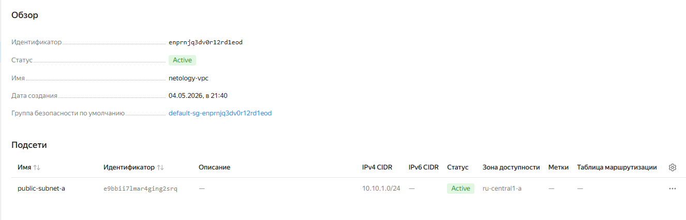
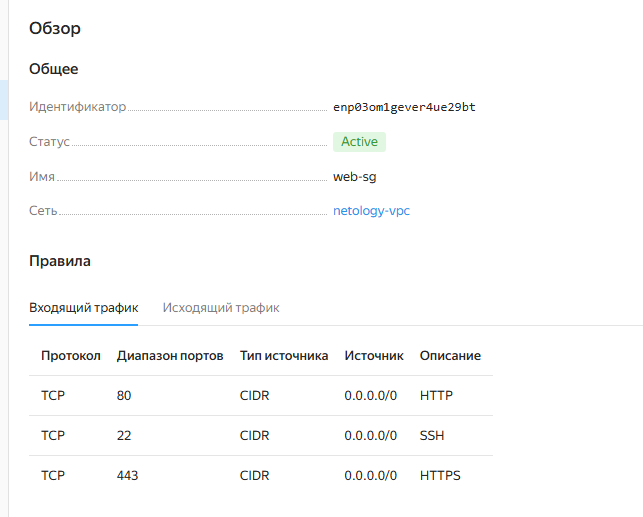
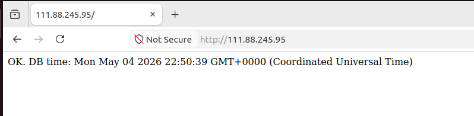

# Домашнее задание к занятию «Итоговый проект модуля «Облачная инфраструктура. Terraform» - Петр Петров

### Задание 1. 
Развертывание инфраструктуры в Yandex Cloud.

- Создайте Virtual Private Cloud (VPC).
- Создайте подсети.
- Создайте виртуальные машины (VM):
  - Настройте группы безопасности (порты 22, 80, 443).
  - Привяжите группу безопасности к VM.
- Опишите создание БД MySQL в Yandex Cloud.
- Опишите создание Container Registry.

### Решение 1.

Создана Virtual Private Cloud (VPC) и подсеть в зоне `ru-central1-a`   



Настроены группы безопасности для разрешающих правил  


 
База данных MySQL создавалась с использованием ресурса yandex_mdb_mysql_cluster в Terraform.  

- был создан кластер управляемой базы данных MySQL версии 8.0
- выбран тип окружения PRESTABLE
- указана сеть (network_id), в которой будет размещён кластер
- задан хост в зоне ru-central1-a, привязанный к подсети

Для ограничения доступа к базе данных была создана отдельная группа безопасности, разрешающая подключение по порту 3306 только из подсети приложения  

Создал базу данных yandex_mdb_mysql_database имя: appdb с пользователем yandex_mdb_mysql_user с именем appuser внутри кластера MySQL. 

Приложение подключается к базе через:  
- FQDN кластера (выходной параметр Terraform)
- переменные окружения (DB_HOST, DB_USER, DB_PASSWORD и др.)

Создание Container Registry:  

Для хранения Docker-образа приложения использовался ресурс: yandex_container_registry. Был создан Container Registry с именем:

netology-registry  

Container Registry используется для:

- хранения Docker-образов приложения
- передачи образа в виртуальную машину
- последующего запуска контейнера через Docker Compose

State-файл хранится удаленно в Yandex Object Storage  

После создания registry:  
Выполнен логин:  
```
docker login cr.yandex
```
Собран Docker-образ:  


Образ отправлен в registry:  


После запуска виртуальной машины Docker автоматически скачивает образ из Container Registry и запускает приложение.  

### Задание 2. 

Используя user-data (cloud-init), установите Docker и Docker Compose (см. Задания 5 модуля «Виртуализация и контейнеризация»).

### Решение 2.

При создании виртуальной машины в Terraform содержимое cloud-init.yml.tpl передаётся в виртуальную машину и выполняется при её первом запуске

[cloud-init.yml.tpl](./templates/cloud-init.yml.tpl)

### Задание 3.

Опишите Docker файл (см. Задания 5 «Виртуализация и контейнеризация») c web-приложением и сохраните контейнер в Container Registry.

### Решение 3.

Был создан Dockerfile, описывающий сборку контейнера с web-приложением на Node.js.

В качестве базового образа использован node:20-alpine.
В контейнер копируются файлы приложения, устанавливаются зависимости через npm и задаётся команда запуска сервера.

После сборки образ был создан с использованием команды docker build и помечен тегом, соответствующим адресу Container Registry.

Затем образ был загружен в Yandex Container Registry с помощью команды docker push.

В дальнейшем данный образ используется виртуальной машиной, разворачиваемой через Terraform, где он автоматически загружается и запускается через Docker Compose.

При загрузке выполняются:
- Обновление пакетов.
- Установка Docker Engine и Docker Compose plugin.
- Создание конфигурационных файлов приложения.
- Автоматический запуск контейнера.

### Задание 4.

Завяжите работу приложения в контейнере на БД в Yandex Cloud.  

### Решение 4.
Приложение доступно по IP адресу: `http://111.88.245.95`  

Приложение успешно подключается к Managed MySQL и отображает текущее время, полученное из базы данных.  


