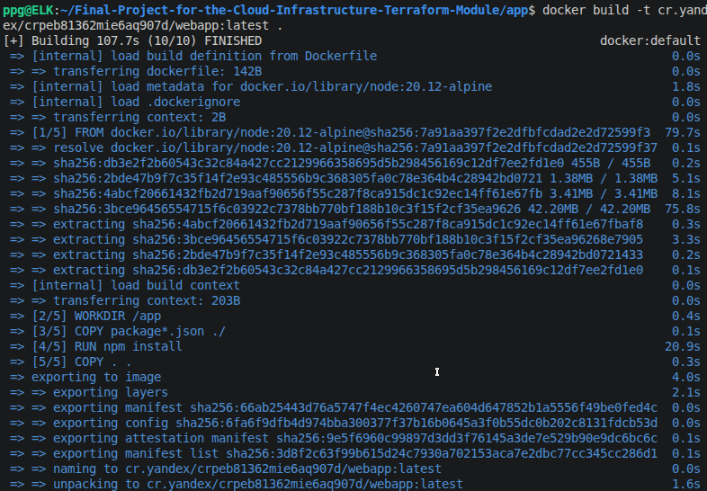
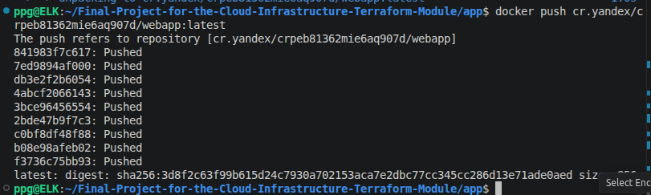

# Домашнее задание к занятию «Итоговый проект модуля «Облачная инфраструктура. Terraform» - Петр Петров

### Задание 1. 
Развертывание инфраструктуры в Yandex Cloud.

- Создайте Virtual Private Cloud (VPC).
- Создайте подсети.
- Создайте виртуальные машины (VM):
  - Настройте группы безопасности (порты 22, 80, 443).
  - Привяжите группу безопасности к VM.
- Опишите создание БД MySQL в Yandex Cloud.
- Опишите создание Container Registry.

### Решение 1. 
База данных MySQL создавалась с использованием ресурса yandex_mdb_mysql_cluster в Terraform.  

- был создан кластер управляемой базы данных MySQL версии 8.0
- выбран тип окружения PRESTABLE
- указана сеть (network_id), в которой будет размещён кластер
- задан хост в зоне ru-central1-a, привязанный к подсети

Для ограничения доступа к базе данных была создана отдельная группа безопасности, разрешающая подключение по порту 3306 только из подсети приложения  

Создали базу данных yandex_mdb_mysql_database имя: appdb с пользователем yandex_mdb_mysql_user с именем appuser внутри кластера MySQL. 

Приложение подключается к базе через:  
- FQDN кластера (выходной параметр Terraform)
- переменные окружения (DB_HOST, DB_USER, DB_PASSWORD и др.)

Создание Container Registry:  

Для хранения Docker-образа приложения использовался ресурс: yandex_container_registry. Был создан Container Registry с именем:

netology-registry  

Container Registry используется для:

- хранения Docker-образов приложения
- передачи образа в виртуальную машину
- последующего запуска контейнера через Docker Compose

После создания registry:  
Выполнен логин:  
```
docker login cr.yandex
```
Собран Docker-образ:  



Образ отправлен в registry:  



После запуска виртуальной машины Docker автоматически скачивает образ из Container Registry и запускает приложение.  

